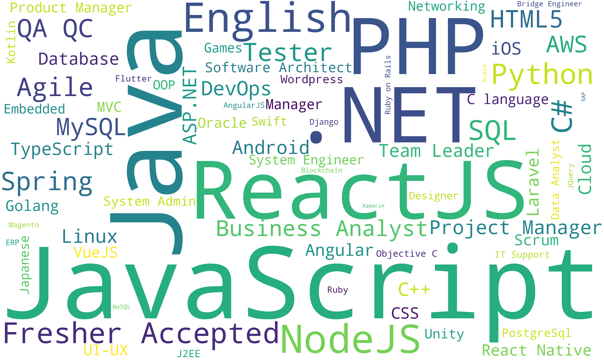
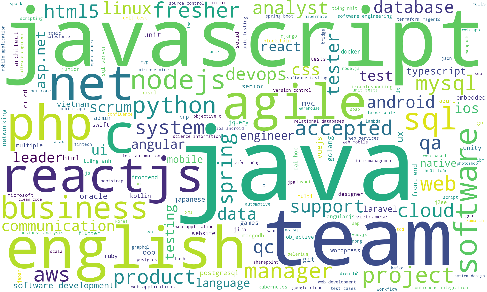

# Job Description Lakehouse

**Table of Contents**
1. [Introduction](#1-introduction)
2. [Installation](#2-installation)
3. [Implementation](#3-implementation)  
    a. [Airflow DAG setup](#a-airflow-dag-setup)  
    b. [Data Pipeline](#b-data-pipeline)  
4. [Result](#4-result)
5. [Conclusion & Future Improvement](#5-conclusion-and-future-improvement)
---

## 1. Introduction
Project implements 
4-staged Data Pipeline and 
[Medallion Architecture](https://www.databricks.com/glossary/medallion-architecture) 
to build a simple lakehouse for Job-Description data

| Stage       | Description                                              |
|-------------|----------------------------------------------------------|
| Integration | Collect new job(s) from source and ingest to Kafka       |
| Storage     | ETL new job(s) from Kafka to Bronze Table                |
| Processing  | ETL new job(s) from Bronze Table to Silver & Gold Tables |
| Analysis    |                                                          |
 
> Note: Implementation of collecting new job-descriptions in Integration-Stage has been 
> REMOVED

## 2. Installation
|                | Requirements                                                                                           | Reference                                                                               |
|----------------|--------------------------------------------------------------------------------------------------------|-----------------------------------------------------------------------------------------|
| Python         | requirements.txt                                                                                       ||
| Apache Kafka   | Bash Script to start/stop Kafka, Zookeeper                                                             | [Start script](scripts/kafka/autostart.sh) [Stop script](scripts/kafka/autostop.sh) |
| Apache Airflow |||
| Apache Spark   | [Spark Elasticsearch](https://search.maven.org/artifact/org.elasticsearch/elasticsearch-spark-30_2.12) ||
| Elasticsearch  | change sshd_config "PermitRootLogin yes" for local access                                              ||

## 3. Implementation
### a. Airflow DAG setup
#### Connection

Create Airflow Connection for each type of server
- Apache Hadoop
  - for ssh and start/stop hadoop
- Apache Kafka
  - for ssh and start/stop kafka
  - store config: topic
- Elasticsearch
  - for ssh and start/stop elasticsearch
  - store config: index

### b. Data Pipeline
## 4. Result
### Job Description Medallion Table

| id  | source | collect_id | title             | tags                 | overview           | requirement          | benefit              | company              |
|-----|--------|------------|-------------------|----------------------|--------------------|----------------------|----------------------|----------------------|
| 0   | *hide  | null       | Support Engine... | [IT Support, Linu... | We are looking ... | Working shifts: 7... | The Nakivo team i... | Nakivo               |
| 1   | *hide  | null       | Magento Develo... | [Magento, SQL, PHP]  | Operate a cosme... | Qualifications: B... | Nice boss, flexib... | CJ OLIVENETWORKS ... |
| 2   | *hide  | null       | .NET Developer... | [ASP.NET, .NET]      | We are SCC – Sp... | Must have 02+ yea... | Competitive Remun... | SCC Vietnam          |
| 3   | *hide  | null       | Infrastructure... | [System Engineer,... | The Infrastruct... | Essential Require... | We create a envir... | SCC Vietnam          |
| 4   | *hide  | null       | Senior Service... | [JavaScript, CSS]    | ServiceNow is a... | • At least 4 year... | We create a envir... | SCC Vietnam          |
> Example of Silver Table of Job-Descriptions

### Word cloud

> Word Cloud of Tags tagged by Employer 
> using Gold Tag Table

###

> Word Cloud of analyzed Tags 
> using Elasticsearch and tags.txt file
>   - Job:Tags has 6 points
>   - Job:Overview/Requirement/Benefit has 1 point

## 5. Conclusion and Future Improvement
> Using advanced analysis generated more tags and more context

### Business Improvement
- Collect Job_description(s) from multiple source
- Process Job_description(s) post time
### Technical Improvement
#### a. Platform Improvement
- Change File-system to Apache Hadoop
- Implement Kafka with KRaft
- Fix bug for Airflow Pipeline
#### b. Code Technique Improvement
- logging library instead of print
- refactor unittest
#### c. Analysis Improvement
- Filter duplication of Job_descriptions
- Handle synonym terms (e.g. kubernetes or k8s, go or golang)
- Handle terms of same root words (e.g. experiences, experience)
